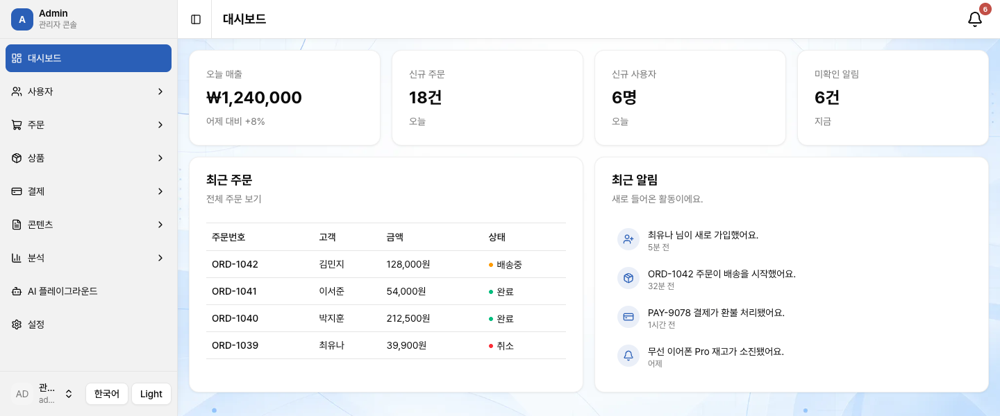
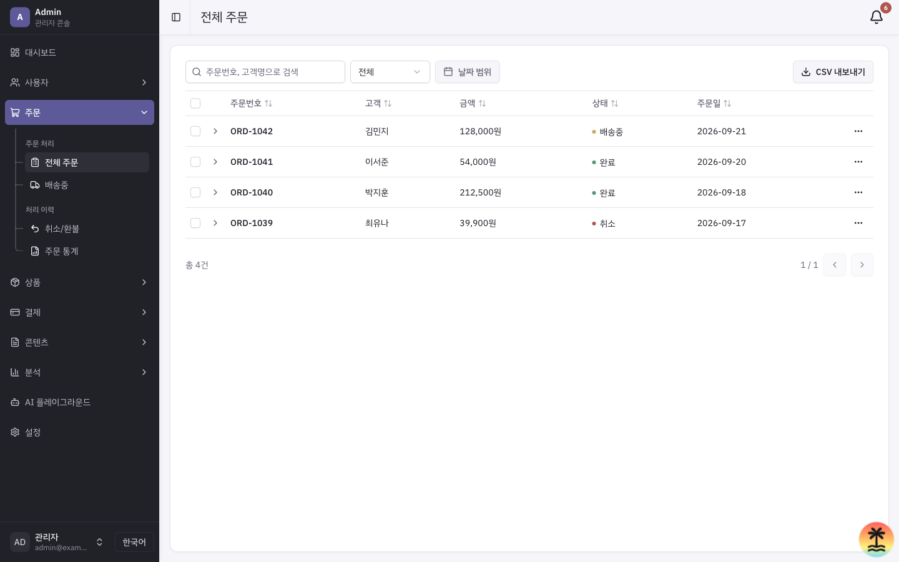
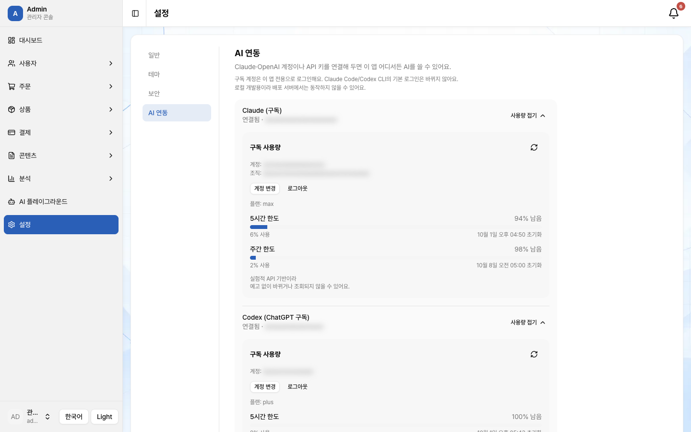
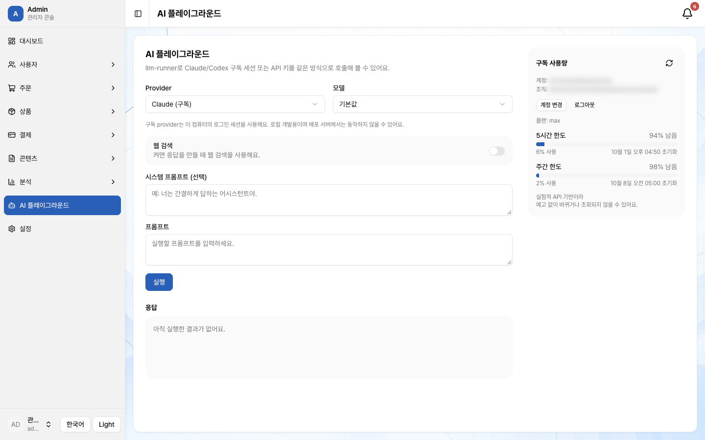

# tanstack-start-kit

TanStack Start 기반의 가벼운 **데스크톱 전용 어드민 콘솔 셸 킷**이에요.
실제 DB와 외부 인증만 빈 자리로 남겨 두었고, 나머지는 바로 동작하는 예시로 갖춰져 있어요.

- **레이아웃:** 사이드바 + 헤더 + 푸터
- **테마:** 스타일 4종(Clean, Soft, Editorial, Crisp) × 컬러 팔레트(기본 무채색 + 2종)
- **다국어:** 한국어 / 영어
- **폼:** `react-hook-form` + `zod` 검증
- **서버 데이터:** 서버 함수 + React Query
- **리스트 패턴:** 검색 · 필터 · 정렬 · 일괄작업 · CSV 내보내기 · 상세보기
- **AI 연동:** Claude / Codex 구독 계정 또는 API 키 (설정 > AI 연동)

> **AI 코딩 에이전트**(Claude Code, Cursor, Codex 등)로 확장할 계획이라면 [AGENTS.md](./AGENTS.md)를 먼저 읽어보세요.
> 왜 이렇게 만들었는지, 무엇을 건드리면 안 되는지가 정리돼 있어요. 이 문서는 사람이 처음 훑어보기 위한 요약이에요.

## 미리보기

| 대시보드                                          |
| ------------------------------------------------- |
|  |

| 주문 리스트 (검색/필터/정렬/CSV)                  | 설정 > AI 연동                                          |
| ------------------------------------------------- | ------------------------------------------------------- |
|  |  |

| AI 플레이그라운드                                              |
| -------------------------------------------------------------- |
|  |

> 스크린샷의 계정 정보는 가렸어요. 데모 데이터와 데모 계정만 쓰고 있어요.

## 새 프로젝트 시작하기

이 저장소는 GitHub 템플릿 저장소로 등록돼 있습니다. GitHub에서 "Use this template" 버튼을
누르거나, `gh` CLI로 바로 새 프로젝트를 만들 수 있습니다:

```bash
gh repo create my-new-app --template josunghoon53/tanstack-start-kit --clone
cd my-new-app
pnpm install && pnpm dev
```

기존 git 히스토리 없이 깨끗한 커밋 하나로 시작됩니다. `package.json`의 `name`과
`src/config/site.ts`의 `APP_NAME`을 새 프로젝트 이름으로 바꾸는 것부터 시작하면 됩니다.

## 지금 갖춰진 것

- **레이아웃**: 사이드바 + 헤더 + 풀 푸터(브랜드/링크/저작권)가 항상 고정, 콘텐츠 영역만
  스크롤됩니다. 모바일 반응형은 지원하지 않는 데스크톱 전용 콘솔입니다(뷰포트 1280px 고정).
- **테마**: 스타일 4종(Clean, Soft, Editorial, Crisp)과 컬러 팔레트(기본 무채색 + 3색 프리셋 2종)를 `설정 > 테마`에서
  고릅니다. 스타일은 모양과 글꼴만 바꿉니다. 팔레트는 사이드바를 주색으로 칠하고, 메인에서는 주요 버튼·링크·차트 강조 1개·활성 탭·칩에만 색을 쓰며 큰 면은 항상 무채색입니다.
  라이트 전용입니다(다크 모드 없음).
- **다국어**: 한국어/영어 지원(`src/i18n/`). 사이드바 하단 언어 토글로 전환하고, 선택은
  브라우저에 저장됩니다.
- **인증**: 데모 계정으로 로그인되는 쿠키 세션(`src/server/session.ts`). 실제 서비스로
  바꾸기 전 반드시 교체해야 할 부분입니다 — 아래 "프로덕션 전 할 일" 참고.
- **데이터**: `orders`/`users`/`contents`/`products`/`payments` 5개 리스트 페이지, 대시보드,
  헤더 알림까지 전부 서버 함수(`createServerFn`) + React Query로 붙어 있습니다. 지금은
  `src/config/*.ts`의 인메모리 배열을 반환하지만, 실제 DB를 붙일 때는 서버 함수 내부만
  바꾸면 됩니다.
- **폼**: `react-hook-form` + `zod` 기반 검증(로그인, 설정 페이지).
- **UI 패턴**: 검색/페이지네이션, 단일·다중선택 필터, 날짜 범위 필터, 컬럼 정렬, 체크박스
  다중선택 + 일괄작업 + CSV 내보내기, 행 액션 모달(수정/삭제/보기), 인라인 상세 확장,
  토스트 피드백이 리스트 페이지마다 동일하게 재사용됩니다.
- **AI 연동**: `설정 > AI 연동` 탭에서 Claude/Codex **구독 계정** 로그인 또는 **API 키**
  (`ANTHROPIC_API_KEY`, `OPENAI_API_KEY`) 연결 상태를 확인하고, 구독 사용량(5시간/주간 한도)을
  볼 수 있습니다. `AI 플레이그라운드`(`/llm-runner`)에서 프롬프트를 실행해 볼 수 있고, Codex
  구독은 이미지 생성도 됩니다. [`llm-runner`](https://www.npmjs.com/package/llm-runner) 기반입니다.
- **테스트**: `vitest` + `@testing-library/react`로 위 기능 전체를 커버합니다(219개 테스트).

## 시작하기

```bash
pnpm install
pnpm dev
```

`http://localhost:3000`에서 데모 계정으로 로그인하세요: `admin@example.com` / `admin1234`
(계정 정보는 `src/config/auth.ts`에 있습니다).

## 명령어

```bash
pnpm dev         # 개발 서버 (:3000)
pnpm build       # 프로덕션 빌드
pnpm preview     # 빌드 결과 미리보기
pnpm lint        # eslint
pnpm format      # prettier --write . && eslint --fix
pnpm check       # prettier --check .
pnpm test        # vitest run (유닛/컴포넌트 테스트, 1회 실행)
pnpm test:watch  # vitest (watch 모드)
```

## AI 연동 사용하기

- **구독 계정(로컬 개발용)**: Claude Code 또는 Codex CLI를 설치한 뒤(`npx llm-runner-setup`으로
  확인), `설정 > AI 연동`에서 로그인하세요. 이 앱 전용 계정이라 CLI의 기본 로그인은 바뀌지 않습니다.
  배포 서버에는 로그인 세션이 없어서 동작하지 않습니다.
- **API 키(배포용)**: 서버 환경 변수에 `ANTHROPIC_API_KEY` / `OPENAI_API_KEY`를 설정하세요.
  로컬 개발에서는 프로젝트 루트의 `.env`에 넣고 dev 서버를 재시작하면 됩니다.
- 비용이 나가는 호출이라 로그인한 사용자만 실행할 수 있지만, 역할(RBAC)은 없어서 로그인한
  누구나 실행할 수 있습니다. 실제 서비스에서는 권한 체크를 추가하세요.

## 새 페이지 추가하기

리스트 페이지 하나를 추가하려면 기존 페이지(예: `orders`)를 그대로 복제하면 됩니다:

1. `src/config/<도메인>.ts` — 데이터 배열 + 타입 + 상태 톤
2. `src/server/<도메인>.ts` — `createServerFn` + `queryOptions` (인증 필요하면 `authMiddleware` 사용)
3. `src/routes/<도메인>.tsx` — `loader`에서 prefetch, `useSuspenseQuery`로 읽기, 검색창+필터+테이블+
   페이지네이션 전체를 `Card`/`CardContent`(`className="flex-1"`)로 감싸기
4. `src/config/nav.ts`에 사이드바 메뉴 항목 추가, `src/i18n/messages.ts`에 텍스트 키 추가

라우팅은 TanStack Router의 파일 기반 라우팅이라, `src/routes/`에 파일만 추가하면
`routeTree.gen.ts`가 자동 생성됩니다(직접 수정하지 마세요).

## 프로덕션 전 할 일

- `src/server/session.ts`의 `SESSION_PASSWORD`를 환경변수로 교체하고 로테이션할 것
- `src/config/auth.ts`(데모 계정)를 지우고 `src/server/auth.ts`의 `loginFn` 검증 로직을
  실제 DB/외부 인증 서비스 호출로 교체할 것
- `src/config/*.ts`의 목업 데이터를 실제 DB 쿼리로 교체할 것(서버 함수 내부만 수정)
- 역할(RBAC)·권한 로직은 없습니다 — 필요하면 새로 설계해야 합니다

## 스택

TanStack Start · TanStack Router · React 19 · Vite 8 · Tailwind CSS v4 · shadcn/ui ·
TanStack Query · Zustand · react-hook-form + zod · llm-runner · Vitest

더 자세한 설계 결정과 "이렇게 하지 말 것" 목록은 [AGENTS.md](./AGENTS.md)에 있습니다.

## 라이선스

[MIT](./LICENSE)
